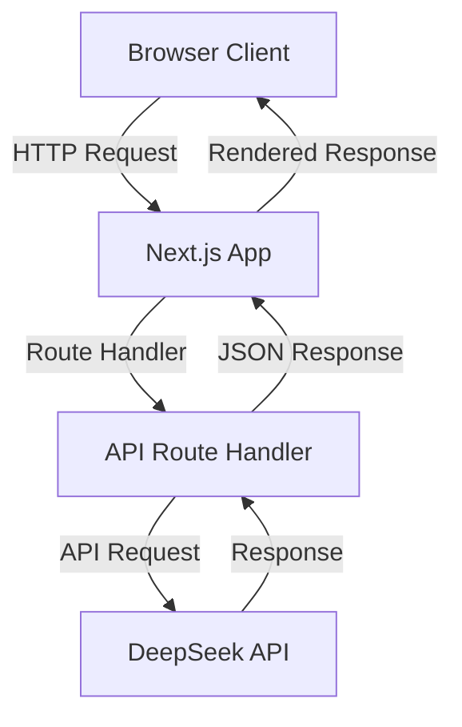
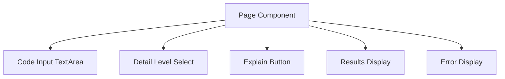
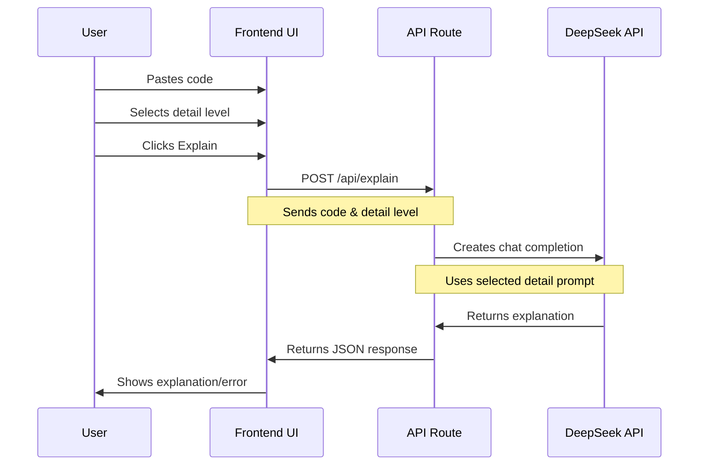
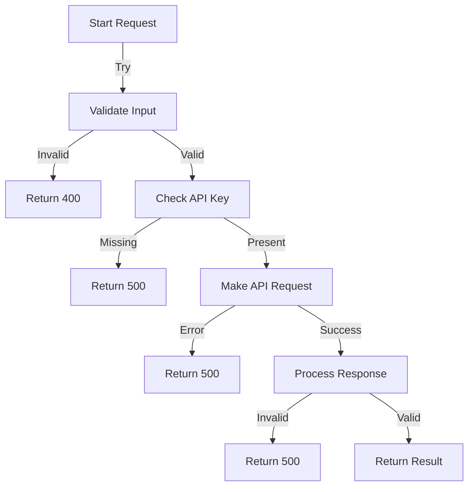
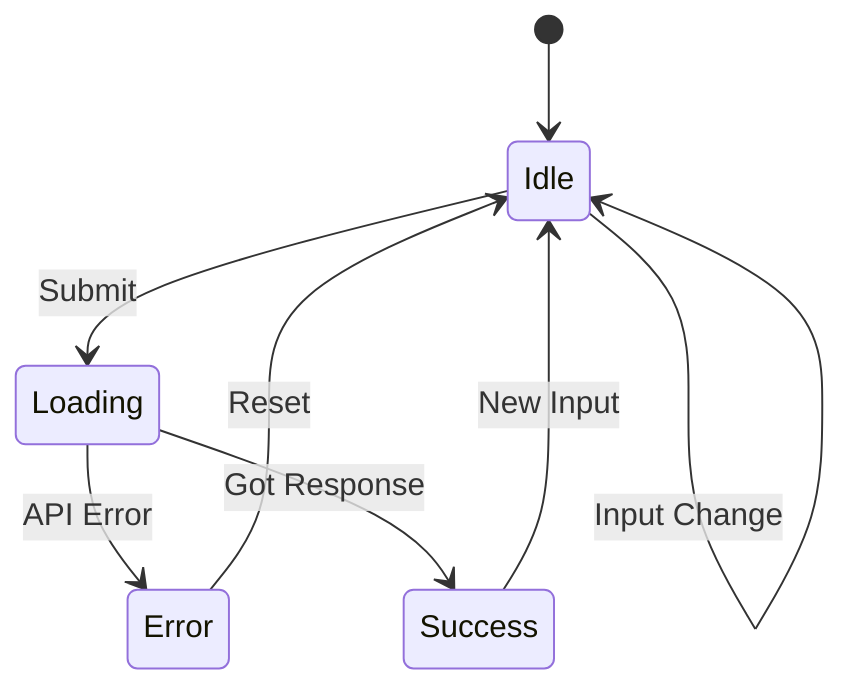

# Code Explainer


This project uses the [DeepSeek API](https://api-docs.deepseek.com/) to provide detailed explanations of code snippets. DeepSeek is a powerful API that leverages advanced AI models to analyze and explain code in various programming languages.

## Features of DeepSeek API

- **Code Analysis**: Understand the purpose and functionality of code snippets.
- **Detail Levels**: Choose between brief, medium, and detailed explanations.
- **Error Handling**: Provides meaningful error messages for invalid requests.

## Getting Started with DeepSeek API

To use the DeepSeek API, you need to sign up for an account and obtain an API key. Follow these steps:

1. Visit the [DeepSeek API Documentation](https://api-docs.deepseek.com/).
2. Sign up for an account.
3. Obtain your API key from the dashboard.
4. Add your API key to the `.env.local` file in your project.

```env
DEEPSEEK_API_KEY=your_api_key_here
```

## Architecture Overview

### System Architecture


### Component Structure


### Request Flow


### Error Handling Flow


### State Management


## Getting Started

First, run the development server:

```bash
npm run dev
# or
yarn dev
# or
pnpm dev
# or
bun dev
```

Open [http://localhost:3000](http://localhost:3000) with your browser to see the result.

You can start editing the page by modifying `app/page.tsx`. The page auto-updates as you edit the file.

This project uses [`next/font`](https://nextjs.org/docs/app/building-your-application/optimizing/fonts) to automatically optimize and load [Geist](https://vercel.com/font), a new font family for Vercel.

## About This Project

This project is a code explainer application built with Next.js. It allows users to paste code, select the level of detail for the explanation, and get an explanation of the code using the DeepSeek API.

### Handling Deprecation Warning

You might encounter the following deprecation warning:
```
(node:9371) [DEP0040] DeprecationWarning: The `punycode` module is deprecated. Please use a userland alternative instead.
(Use `node --trace-deprecation ...` to show where the warning was created)
```

This warning indicates that the `punycode` module is deprecated. To resolve this, identify where the `punycode` module is being used in your project or its dependencies and replace it with an alternative library from the npm registry.

### Handling 402 Insufficient Balance Error

If you encounter the following error:
```
POST /api/explain 402 in 1024ms
```

This means that the API request failed due to insufficient balance. Check your account balance on the DeepSeek platform and ensure you have enough credits to make the API requests. Add funds to your account or upgrade your subscription plan if necessary.

## Pushing to GitHub

To push this project to your GitHub repository, follow these steps:

1. Initialize a new Git repository:
    ```bash
    git init
    ```

2. Add all files to the repository:
    ```bash
    git add .
    ```

3. Commit the changes:
    ```bash
    git commit -m "Initial commit"
    ```

4. Add your GitHub repository as a remote:
    ```bash
    git remote add origin https://github.com/bniladridas/code-explainer.git
    ```

5. Push the changes to the GitHub repository:
    ```bash
    git push -u origin main
    ```

## Learn More

To learn more about Next.js, take a look at the following resources:

- [Next.js Documentation](https://nextjs.org/docs) - learn about Next.js features and API.
- [Learn Next.js](https://nextjs.org/learn) - an interactive Next.js tutorial.

You can check out [the Next.js GitHub repository](https://github.com/vercel/next.js) - your feedback and contributions are welcome!

## Deploy on Vercel

The easiest way to deploy your Next.js app is to use the [Vercel Platform](https://vercel.com/new?utm_medium=default-template&filter=next.js&utm_source=create-next-app&utm_campaign=create-next-app-readme) from the creators of Next.js.

Check out our [Next.js deployment documentation](https://nextjs.org/docs/app/building-your-application/deploying) for more details.

## Standard Stanford

This project follows the standard practices and guidelines set by Stanford University for software development. For more information, refer to the [Stanford Software Development Guidelines](https://stanford.edu/software-guidelines).

## Meta

This project is maintained by [Niladri Das](https://github.com/bniladridas). Contributions, issues, and feature requests are welcome. Feel free to check the [issues page](https://github.com/bniladridas/code-explainer/issues) if you have any questions or suggestions.